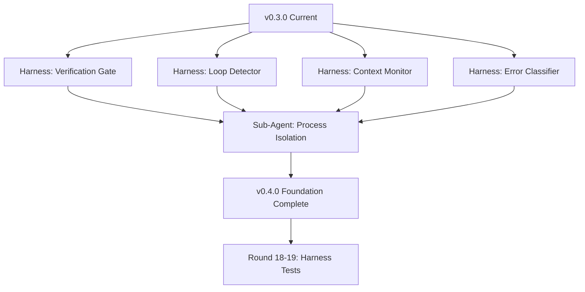
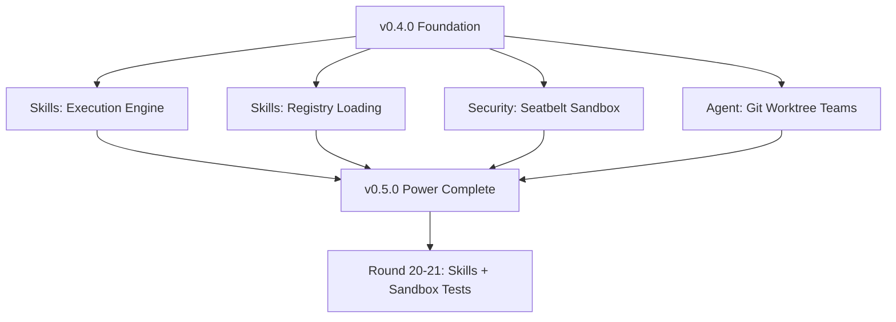
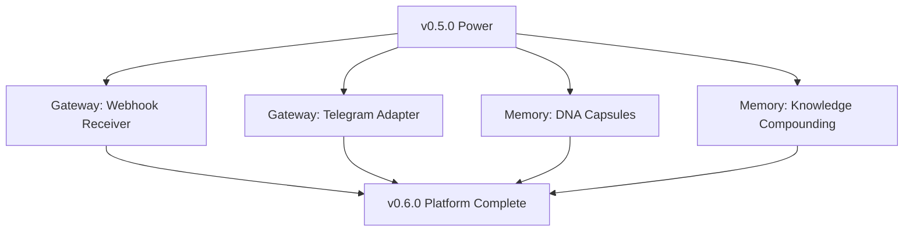
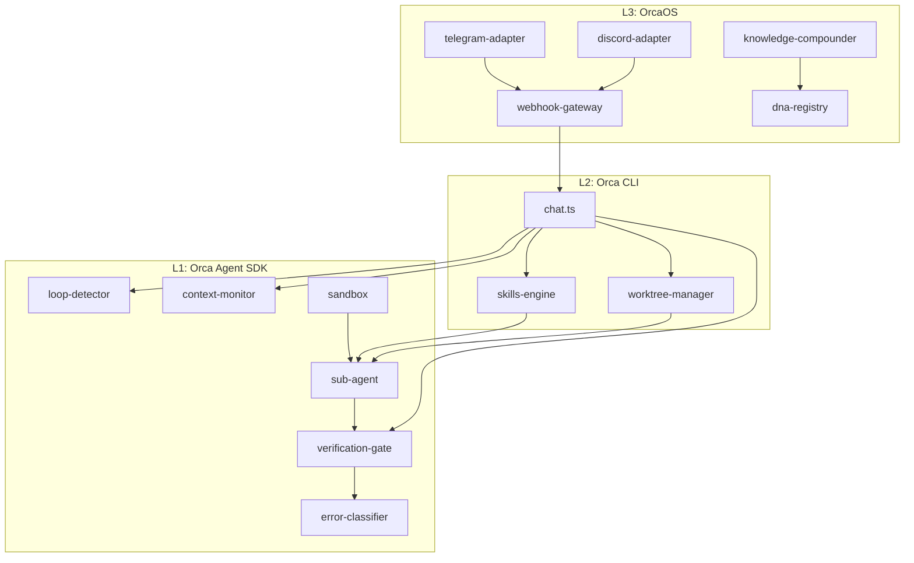

# Orca SOTA Architecture — Upgrade Roadmap

> v0.3.0 → v0.6.0 | Three-phase transplant from AI-Fleet + competitors

## Architecture Vision

```
┌─────────────────────────────────────────────────────────────┐
│  OrcaOS  v0.6.0  (L3: Platform Layer)                      │
│  Gateway · Webhook · Telegram · Discord · HTTP serve        │
├─────────────────────────────────────────────────────────────┤
│  Orca CLI  v0.5.0  (L2: User-Facing CLI)                   │
│  Skills Engine · Mode System · Agent Teams · 50+ tools      │
│  Council · Race · Pipeline · 27 slash commands              │
├─────────────────────────────────────────────────────────────┤
│  Orca Agent SDK  v0.4.0  (L1: Core Runtime)                │
│  Harness Layer · Sub-Agent Isolation · Sandbox · MCP 2.0    │
│  Token Budget · Verification Gate · Loop Detector           │
├─────────────────────────────────────────────────────────────┤
│  OpenAI-compat Provider · SQLite Usage · 9 Providers        │
│  SSE streaming · 429 auto-retry · model-aware max_tokens    │
└─────────────────────────────────────────────────────────────┘
```

---

## Phase 1: Foundation (v0.3.0 → v0.4.0)

### Goal: Close the "harness gap" — the 20-point delta between model capability and agent delivery



### 1.1 Verification Gate (`src/harness/verification-gate.ts`)

Port from AI-Fleet `core/harness/verification_gate.py` (23.2K Python → ~800 LOC TypeScript)

**Responsibility**: Pre-completion quality check before marking any task as done.

```typescript
interface VerificationResult {
  passed: boolean
  checks: CheckResult[]
  remediation?: string  // micro-prompt for model to self-fix
}

interface CheckResult {
  name: 'git_clean' | 'lint' | 'typecheck' | 'test' | 'ai_check'
  status: 'pass' | 'fail' | 'skip'
  output?: string
  duration: number
}

export async function runVerificationGate(cwd: string): Promise<VerificationResult>
```

**Detection logic**:
- Node/TS: `tsc --noEmit` + `eslint .` + `npm test`
- Python: `ruff check .` + `mypy .` + `pytest`
- Go: `go vet ./...` + `go test ./...`
- Rust: `cargo check` + `cargo test`

### 1.2 Loop Detector (`src/harness/loop-detector.ts`)

Port from AI-Fleet `core/harness/loop_detector.py` (13.5K → ~400 LOC)

**Responsibility**: Track consecutive failures per file/function. Tw93 rule: 2 failures → PIVOT, 3+ → ESCALATE.

```typescript
interface LoopState {
  file: string
  function: string
  failures: number
  lastError: string
}

export class LoopDetector {
  recordFailure(file: string, fn: string, error: string): 'continue' | 'pivot' | 'escalate'
  recordSuccess(file: string, fn: string): void
  getState(): LoopState[]
}
```

### 1.3 Context Monitor (`src/harness/context-monitor.ts`)

Port from AI-Fleet `core/harness/context_monitor.py` (11.6K → ~350 LOC)

**Responsibility**: Track context utilization and trigger compaction.

```typescript
type RiskLevel = 'green' | 'yellow' | 'orange' | 'red'

export class ContextMonitor {
  recordUsage(inputTokens: number, outputTokens: number): void
  getUtilization(modelWindow: number): number  // 0.0 - 1.0
  getRiskLevel(): RiskLevel
  shouldCompact(): boolean   // true when >= 40%
  shouldClear(): boolean     // true when >= 60%
}
```

Thresholds (from arXiv:2603.05344):
| Utilization | Risk | Action |
|---|---|---|
| <40% | GREEN | OK |
| 40-50% | YELLOW | Suggest /compact |
| 50-60% | ORANGE | Force /compact |
| >60% | RED | Force /clear + HANDOFF.md |

### 1.4 Error Classifier (`src/harness/error-classifier.ts`)

Port from AI-Fleet `core/harness/error_classifier.py` (8.5K → ~300 LOC)

**Responsibility**: Classify tool errors into actionable categories for recovery hints.

```typescript
type ErrorCategory = 'auth' | 'rate_limit' | 'not_found' | 'timeout' | 'syntax' | 'permission' | 'unknown'

export function classifyError(error: string): {
  category: ErrorCategory
  suggestion: string
  retryable: boolean
}
```

### 1.5 Sub-Agent Isolation (`src/agent/sub-agent.ts`)

New module — inspired by Claude Code's subagent architecture.

**Responsibility**: Spawn isolated child processes for exploration tasks.

```typescript
interface SubAgentConfig {
  task: string
  model?: string         // default: cheapest available
  tools?: string[]       // tool subset (default: read-only)
  timeout?: number       // ms (default: 60000)
  maxTokens?: number     // context budget for sub-agent
}

interface SubAgentResult {
  success: boolean
  output: string
  tokensUsed: number
  duration: number
}

export async function spawnSubAgent(config: SubAgentConfig, cwd: string): Promise<SubAgentResult>
```

Implementation: fork a child process running Orca's agent loop with restricted tool set.

### 1.6 Fix Existing Stubs

| Stub | Current State | Fix |
|---|---|---|
| `spawn_agent` tool | Returns stub string | Wire to `spawnSubAgent()` |
| `delegate_task` tool | Returns stub string | Wire to `spawnSubAgent()` with broader tools |
| Session resume | `-c` flag not wired | Load history + continue conversation |
| `--effort` flag | Defined but ignored | Map to thinking tokens / system prompt tuning |
| Cost tracking | Always 0 | Compute from model pricing table |
| SubagentStop hook | Missing | Add to HOOK_EVENTS and wire |
| Stop hook | Missing | Add to HOOK_EVENTS and wire |

**Phase 1 total**: ~3000 LOC new + ~500 LOC fixes = ~3500 LOC

---

## Phase 2: Power (v0.4.0 → v0.5.0)

### Goal: Add composable skills and security isolation



### 2.1 Skills Execution Engine (`src/skills/engine.ts`)

Port skill-groups.json structure from AI-Fleet.

**Execution modes**:
- **swarm**: Parallel experts, dynamic selection (coreTier + extendedTier)
- **pipeline**: Sequential A → B → C with gate checks
- **loop**: Iterative convergence with maxIterations
- **sequential**: Ordered execution

```typescript
type ExecutionMode = 'swarm' | 'pipeline' | 'loop' | 'sequential'

interface SkillGroup {
  name: string
  skills: string[]
  triggers: string[]
  execution: {
    mode: ExecutionMode
    coreTier?: string[]
    extendedTier?: string[]
    loopSkills?: string[]
    maxIterations?: number
    gateCommand?: string
  }
}

export class SkillEngine {
  loadRegistry(registryPath: string): void
  matchTriggers(input: string): SkillGroup | null
  execute(group: SkillGroup, input: string, cwd: string): Promise<string>
}
```

### 2.2 Security Sandbox (`src/sandbox/index.ts`)

**macOS**: Seatbelt profile generation (inspired by Codex CLI)

```typescript
interface SandboxPolicy {
  allowRead: string[]    // paths readable
  allowWrite: string[]   // paths writable (default: cwd only)
  allowNetwork: boolean  // default: false
  allowExec: string[]    // binaries allowed to execute
}

export function executeSandboxed(command: string, policy: SandboxPolicy, cwd: string): Promise<ExecResult>
```

**Linux**: bwrap (bubblewrap) + Landlock for kernel-level isolation.

### 2.3 Git Worktree Agent Teams (`src/agent/worktree.ts`)

```typescript
interface WorktreeAgent {
  id: string
  branch: string
  worktreePath: string
  task: string
  status: 'working' | 'done' | 'failed'
}

export class WorktreeManager {
  create(task: string, baseBranch?: string): Promise<WorktreeAgent>
  merge(agentId: string): Promise<void>
  cleanup(agentId: string): Promise<void>
  list(): WorktreeAgent[]
}
```

**Phase 2 total**: ~3000 LOC

---

## Phase 3: Platform (v0.5.0 → v0.6.0)

### Goal: Extend Orca from CLI tool to platform agent



### 3.1 Webhook Gateway (`src/gateway/webhook.ts`)

HTTP endpoint that receives POST requests and routes to agent.

```typescript
interface WebhookConfig {
  port: number
  secret: string         // HMAC validation
  routes: WebhookRoute[]
}

interface WebhookRoute {
  path: string           // e.g., /github, /ci
  transform: (payload: unknown) => string  // payload → agent prompt
  responseChannel?: string  // where to send result
}
```

### 3.2 Platform Adapters (`src/gateway/adapters/`)

Each adapter implements:
```typescript
interface PlatformAdapter {
  name: string
  connect(config: Record<string, string>): Promise<void>
  onMessage(handler: (msg: IncomingMessage) => Promise<string>): void
  send(channelId: string, content: string): Promise<void>
  disconnect(): Promise<void>
}
```

Adapters: telegram.ts, discord.ts (Hermes-inspired)

### 3.3 DNA Capsule System (`src/memory/dna.ts`)

Port from AI-Fleet dna-registry.json pattern.

```typescript
interface DNACapsule {
  id: string
  type: 'fix-pattern' | 'skill-override' | 'error-recovery'
  triggers: string[]     // when to apply
  content: string        // knowledge payload
  evidence: string[]     // where it was validated
  createdAt: string
}

export class DNARegistry {
  load(registryPath: string): void
  search(query: string): DNACapsule[]
  inherit(capsuleId: string): string  // returns prompt injection
  solidify(fix: string, context: string): DNACapsule  // create new capsule
}
```

**Phase 3 total**: ~2500 LOC

---

## Test Expansion Plan

| Phase | Round | File | Tests | Coverage Target |
|---|---|---|---|---|
| 1 | 18 | harness-verification.test.ts | 15 | verification gate + error classifier |
| 1 | 19 | harness-loops.test.ts | 15 | loop detector + context monitor |
| 2 | 20 | skills-engine.test.ts | 15 | skill loading + execution modes |
| 2 | 21 | sandbox-security.test.ts | 12 | Seatbelt + bwrap + permission |
| 3 | 22 | gateway-webhook.test.ts | 12 | webhook receiver + routing |
| 3 | 23 | memory-dna.test.ts | 12 | DNA capsule + search + inherit |
| | | **Total new** | **81** | 464 → 545 tests |

---

## Module Dependency Graph



---

## File Structure (New)

```
src/
  harness/
    verification-gate.ts    # P0: pre-completion check
    loop-detector.ts        # P0: failure tracking
    context-monitor.ts      # P0: utilization alerts
    error-classifier.ts     # P0: error categorization
    health.ts               # P1: unified health report
    index.ts                # barrel export
  agent/
    sub-agent.ts            # P0: process-isolated sub-agents
    worktree.ts             # P1: git worktree teams
  skills/
    engine.ts               # P1: skill execution modes
    registry.ts             # P1: skill-groups.json loading
  sandbox/
    index.ts                # P1: sandbox orchestrator
    seatbelt.ts             # P1: macOS sandbox profiles
    bwrap.ts                # P1: Linux bubblewrap
  gateway/
    webhook.ts              # P2: webhook receiver
    adapters/
      telegram.ts           # P2: Telegram bot adapter
      discord.ts            # P2: Discord bot adapter
  memory/
    dna.ts                  # P2: DNA capsule system
    compounder.ts           # P2: knowledge compounding
```

---

## v0.8.0 SOTA Gap Status (2026-04-13)

### Current Reality

| Metric | Value |
|---|---|
| Version | 0.8.0 |
| LOC | 16,722 |
| Tests | 915 (50 files) |
| Modules | 14 directories |
| Tools | 41+ |
| Slash commands | 30+ |

### SOTA Gap Matrix: Orca vs Competitors

| Capability | Claude Code | Codex | Amp | KiloCode | Factory Droid | **Orca v0.8.0** | Gap |
|---|---|---|---|---|---|---|---|
| Multi-model routing | No | No | No | No | No | **Council/Race/Pipeline** | **LEAD** |
| Mission mode (multi-step) | Sub-agents | Codex tasks | No | No | **Droid Missions** | **Mission Mode** | Parity |
| Task auto-decomposition | No | No | No | No | No | **Task Planner** | **LEAD** |
| Concurrent side tasks | No | No | No | No | Worker pool | **executePlan()** | Parity |
| Context protection (nuclear) | Auto-compact | Unknown | Unknown | No | Unknown | **4-layer + nuclear** | **LEAD** |
| 413 auto-recovery | No | Unknown | Unknown | No | Unknown | **Auto-compact + retry** | **LEAD** |
| Cognitive skeleton (hook) | No | No | No | No | No | **9 scenarios** | **LEAD** |
| Goal-loop (done-when) | No | Codex loop | No | No | Droid loop | **runGoalLoop** | Parity |
| Validation contract first | No | No | No | No | **Yes** | **Yes** | Parity |
| Knowledge management | Memory | No | No | No | No | **Notes/Postmortem/Prompts/Learn** | **LEAD** |
| Git worktree isolation | **Yes** | No | No | No | Yes | Planned | **GAP** |
| Sandbox (Seatbelt/bwrap) | **Yes** | **Yes** | No | No | Yes | Planned | **GAP** |
| MCP server ecosystem | **Mature** | No | No | No | No | Basic | **GAP** |
| IDE integration (VS Code) | **Yes** | **Yes** | **Yes** | **Yes** | No | No | **GAP** |
| Hooks system | **Yes** | No | No | No | No | **8 events** | Parity |
| CJK-aware token estimation | No | No | No | No | No | **Yes** | **LEAD** |

### Gap Summary

**LEAD areas (6)**: Multi-model collaboration, task auto-decomposition, context protection, cognitive skeleton, knowledge management, CJK support

**Parity areas (5)**: Mission mode, concurrent execution, goal-loop, validation contract, hooks

**GAP areas (4)**: Git worktree isolation, sandbox security, MCP ecosystem, IDE integration

### Priority Targets for v0.9.0

| Priority | Feature | Competitor Ref | Estimated LOC |
|---|---|---|---|
| P0 | Git worktree agent teams | Claude Code | ~800 |
| P0 | Seatbelt/bwrap sandbox | Codex CLI | ~600 |
| P1 | MCP server discovery + auto-connect | Claude Code | ~500 |
| P1 | VS Code extension skeleton | Amp | ~1000 |
| P2 | DNA capsule inheritance | Factory Droid | ~400 |
| P2 | Webhook gateway (Telegram/Discord) | Hermes | ~600 |

### Achieved Milestones (v0.4.0 → v0.8.0)

| Milestone | Status | Evidence |
|---|---|---|
| v0.4.0 Harness layer | DONE | VerificationGate + LoopDetector + ContextMonitor + ErrorClassifier |
| v0.4.0 Sub-agent isolation | DONE | spawnSubAgent with process fork + IPC |
| v0.5.0 Skills engine | DONE | ModeRegistry + command picker |
| v0.5.0 Session resume | DONE | `orca chat -c` + auto-save |
| v0.6.0 Knowledge system | DONE | Notes + Postmortem + Prompts + Learning Journal |
| v0.7.0 Cognitive skeleton | DONE | 9 scenarios × 4 models, always-on hook |
| v0.7.0 Goal-loop controller | DONE | `orca run --done-when` with regex/command/judge |
| v0.7.0 Context 4-layer protection | DONE | L1 tool truncation + L2 pre-round + L3 PostToolUse + L4 413 recovery |
| v0.8.0 Mission Mode | DONE | Orchestrator/Worker/Validator, validation contract first |
| v0.8.0 Task Planner | DONE | Auto-decompose + concurrent executor + visual checklist |
| v0.8.0 Nuclear compact | DONE | >100% utilization → drop all except system + last user |
| v0.8.0 UI/UX overhaul | DONE | Box-drawing, compact status, clean help |
| v0.8.0 915 tests | DONE | 50 files, all passing |

---

Maurice | maurice_wen@proton.me
