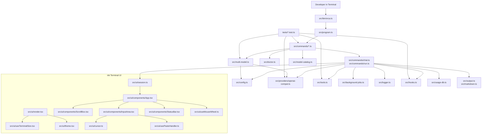

# Orca CLI System Architecture

<!-- AI-FLEET:PROJECT_DIR:START -->
- `PROJECT_DIR`: `/Users/mauricewen/Projects/MARUCIE-orca-cli`
<!-- AI-FLEET:PROJECT_DIR:END -->

## Architecture Summary

Orca CLI is a TypeScript ESM CLI product composed of a terminal entry layer, command layer, runtime/config layer, provider bridge, and test/verification layer. It is a CLI runtime, so the primary surface is command invocation and streaming terminal output rather than browser routes.

## High-Level Diagram

## Layer Breakdown

| Layer | Files | Responsibility |
| --- | --- | --- |
| Entry | `src/bin/orca.ts` | Shell entry point and signal handling |
| Command assembly | `src/program.ts` | Registers commands and default prompt passthrough |
| Command modules | `src/commands/*.ts` | User-facing CLI flows (`chat`, `run`, `multi`, `bench`, `providers`, `stats`, `session`, `pr`, `serve`, `init`) |
| Runtime/config | `src/config.ts`, `src/context.ts`, `src/system-prompt.ts`, `src/token-budget.ts`, `src/model-catalog.ts`, `src/doctor.ts` | Resolve providers, model metadata, runtime diagnostics, context, prompts, and runtime limits |
| Provider bridge | `src/providers/openai-compat.ts` | Provider-neutral transport and model interaction |
| Agent runtime | `src/tools.ts`, `src/background-jobs.ts`, `src/logger.ts`, `src/hooks.ts`, `src/mcp-client.ts`, `src/retry-intelligence.ts`, `src/auto-verify.ts` | Tool execution, detached job tracking, local runtime logging, hooks, MCP, retry behavior, verification helpers |
| ink UI | `src/ui/` (18 files) | React terminal UI: App, ScrollBox, InputArea, StatusBar, Banner, Footer, ThinkingSpinner, ToolCallBlock, DiffPreview, MarkdownText, FileLink, PermissionPrompt, MultiModelProgress, CommandPicker, TurnSummary, AlternateScreen + hooks (useTerminalSize, useMouseWheel, usePasteHandler) + modules (cursor, theme, session, types, utils) |
| Presentation (legacy) | `src/output.ts`, `src/markdown.ts`, `src/command-picker.ts` | Legacy terminal rendering (pre-ink fallback) |
| Persistence | `src/usage-db.ts` | Persistent usage/cost tracking |
| Verification | `tests/*.test.ts` | Automated verification across tool, runtime, hook, SOTA, and multi-model paths |

## Command Surface Map

| Command | Source File | Purpose |
| --- | --- | --- |
| `orca` / `orca chat` | `src/commands/chat.ts` | Interactive REPL and one-shot prompting |
| `orca run` | `src/commands/run.ts` | Agent task execution |
| `orca council` / `orca race` / `orca pipeline` | `src/commands/multi.ts` | Multi-model collaboration flows |
| `orca bench` | `src/commands/bench.ts` | Benchmark and self-evaluation |
| `orca doctor` | `src/commands/doctor.ts` | Local runtime/config diagnostics |
| `orca logs` | `src/commands/logs.ts` | Runtime log viewer |
| `orca providers` | `src/commands/providers.ts` | Provider introspection |
| `orca stats` | `src/commands/stats.ts` | Usage/cost reporting |
| `orca session` | `src/commands/session.ts` | Session lifecycle |
| `orca pr` | `src/commands/pr.ts` | Pull request review workflow |
| `orca serve` | `src/commands/serve.ts` | Headless HTTP + SSE runtime |
| `orca init` | `src/commands/init.ts` | Local configuration bootstrap |

## Route / Page Map

- Web routes: `N/A`
- Primary interaction surface: terminal commands and REPL slash-style workflows
- Headless HTTP surface: `orca serve` (see `src/commands/serve.ts`)
- Detached job state: `~/.orca/background-jobs/` or `$ORCA_HOME/background-jobs/`
- Runtime logs: `~/.orca/logs/` or `$ORCA_HOME/logs/`
- Serve diagnostics: `/health`, `/providers`, `/doctor`
- Serve diagnostics: `/health`, `/providers`, `/doctor`

## Legacy Documentation Cross-References

- `doc/THREE_TIER_ARCHITECTURE.md`: historical broader ecosystem architecture
- `doc/MULTI_MODEL_COLLABORATION.md`: early collaboration-mode design
- `doc/SOTA_TEST_PLAN.md`: historical hardening plan
